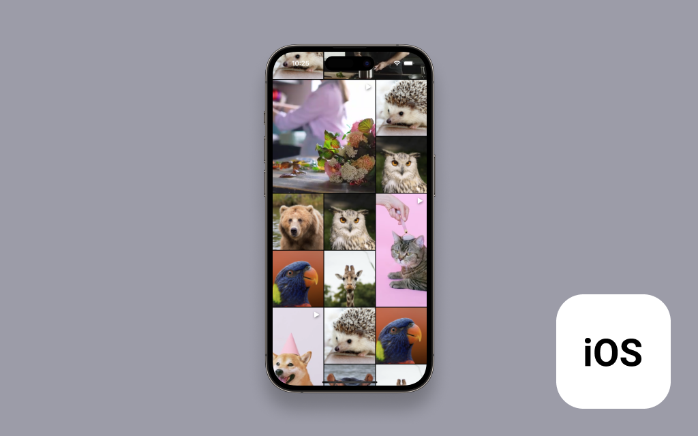

# Amazon IVS Grid feed for iOS Demo

A demo SwiftUI iPhone application intended as an educational tool to demonstrate how you can build a grid feed of autoplaying videos with [Amazon IVS](https://www.ivs.rocks/).

**This project is intended for education purposes only and not for production usage.**

## Setup

1. Clone the repository to your local machine.
2. Install the SDK dependency using CocoaPods: `pod install --repo update`
3. Open `Grid Feed.xcworkspace`.
4. You can now build and run the project on a device.

## Known Issues

- This app has only been tested on devices running iOS 15 or later. While this app may work on devices running older versions of iOS, it has not been tested on them.

## About Amazon IVS

Amazon Interactive Video Service (Amazon IVS) is a managed live streaming solution that is quick and easy to set up, and ideal for creating interactive video experiences. [Learn more](https://aws.amazon.com/ivs/).

- [Amazon IVS docs](https://docs.aws.amazon.com/ivs/)
- [User Guide](https://docs.aws.amazon.com/ivs/latest/userguide/)
- [API Reference](https://docs.aws.amazon.com/ivs/latest/APIReference/)
- [Setting Up for Streaming with Amazon Interactive Video Service](https://aws.amazon.com/blogs/media/setting-up-for-streaming-with-amazon-ivs/)
- [Learn more about Amazon IVS on IVS.rocks](https://ivs.rocks/)
- [View more demos like this](https://ivs.rocks/examples)

## License

This project is licensed under the MIT-0 License. See the LICENSE file.
